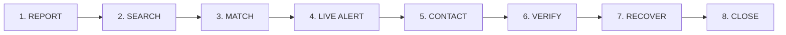
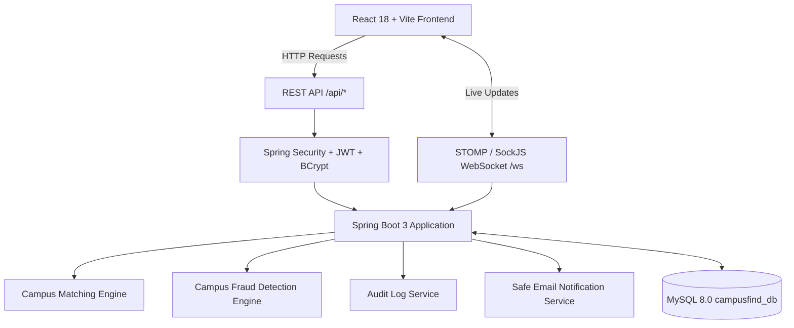

# CampusFind — Campus Lost & Found Portal with Live Alerts

**CampusFind** is a campus-restricted Lost & Found web application designed to help students report lost belongings, register found items, search campus reports, discover potential matches, receive real-time alerts, communicate securely, and mark items as recovered.

---

### Key Capabilities & Architecture:
- **Student account approval**: Mandatory administrative review before granting portal access to verified enrolled students.
- **Lost/found reporting**: Rich reports with campus locations, photo uploads, brand, model, and item categories.
- **Campus search**: Fast campus-wide keyword search and location-specific discovery.
- **Category filtering**: Instant filtering across Electronics, Wallets, IDs, Keys, Books, Clothing, and Bags.
- **Smart matching**: Automated cross-matching between lost and found listings with multi-attribute scoring.
- **Live alerts**: Real-time STOMP/WebSocket and browser notifications for matches and campus announcements.
- **Secure student communication**: Built-in peer-to-peer safe messenger with zero personal phone/address exposure.
- **Recovery workflow**: Full lifecycle from `ACTIVE` ⟶ `MATCHED` ⟶ `CLAIM_PENDING` ⟶ `VERIFICATION` ⟶ `RECOVERED` ⟶ `CLOSED`.
- **Admin verification**: Administrative verification of ownership claims, audit trails, and item handovers.
- **Campus-wide alerts**: Targeted emergency or general broadcasts by department, year, or campus sector.
- **Campus analytics**: Real-time institutional metrics, recovery rates, item distributions, and security logs.

---

## 🔄 Complete Campus Lost & Found Lifecycle

CampusFind executes the complete 8-stage campus recovery lifecycle:



### Visual Recovery Workflow Stepper
Displayed directly on item pages and report cards:
```
ACTIVE  ⟶  MATCHED  ⟶  CLAIM_PENDING  ⟶  VERIFICATION  ⟶  RECOVERED  ⟶  CLOSED
```

1. **REPORT**: Authenticated students submit `LOST` or `FOUND` reports with campus locations, photo uploads, categories, brand, model, color, and date/time.
2. **SEARCH**: Real-time filtering by keyword, campus zone, location, category, date, and status.
3. **MATCH**: Automated cross-matching between opposite item types (Lost vs. Found) prioritizing reports within the same campus.
4. **LIVE ALERT**: Real-time STOMP/WebSocket alerts and simulated campus email notifications dispatched immediately when a matching item is posted.
5. **CONTACT**: Integrated real-time peer-to-peer student messaging without exposing private phone numbers or personal emails.
6. **VERIFY**: Claimant answers private ownership verification questions (unique invisible features, bag contents, case designs, purchase timeframe). Answers are strictly confidential and never displayed publicly.
7. **RECOVER**: Official **`[Mark as Recovered]`** action with confirmation modal ("Have you successfully recovered this item?" ⟶ `Confirm Recovery` / `Cancel`). Updates status to `RECOVERED`, notifies relevant users, and writes to the security audit log.
8. **CLOSE**: Claim and match finalized to `CLOSED` or `RETURNED` with full audit trace.

---

## 🏗 High-Level Architecture



---

## 🌟 Key Core Systems (Parts 1, 2 & 3)

### 1. Official "Mark as Recovered" Workflow
- Located on personal reports (`/my-reports`) and item details (`/items/:id`).
- When clicked, prompts the student with a professional confirmation dialog:
  - *"Have you successfully recovered this item?"*
  - `[Confirm Recovery]` | `[Cancel]`
- Upon confirmation:
  - Transition status to `RECOVERED`.
  - Dispatches WebSocket and in-app notifications.
  - Automatically records an immutable `ITEM_RECOVERED` event in the audit trail.
  - Updates campus recovery rate statistics in real time.

### 2. Smart Campus Matching Engine
- **Cross-Type Search**: Automatically matches `LOST` reports against `FOUND` reports (and vice-versa).
- **Weighted Multi-Factor Scoring**:
  - **Category**: 25%
  - **Brand**: 15%
  - **Model**: 15%
  - **Color**: 10%
  - **Campus Location**: 15%
  - **Date**: 10%
  - **Description**: 10%
  - **Total**: 100%
- **Explainable Match Breakdown**:
  - E.g., *"89% Potential Match"*
  - Displays explicit matching attributes (`✓ Same category: Wallet`, `✓ Same campus location: Canteen`) and differences (`✕ Different model`).

### 3. Confidential Ownership Verification System
- Protects found items from fraudulent claims with private verification questions:
  - *"Describe a unique feature that is not visible in the listing."*
  - *"What was inside the bag / compartment?"*
  - *"What was the phone case design or wallpaper?"*
  - *"What is the approximate purchase date?"*
- **Confidentiality Guarantee**: Private verification answers are encrypted/stored in MySQL and **never exposed publicly** in item endpoints. Only the claimant, finder, and admins can view them.

### 4. Admin Command Center & Campus Management
- Dedicated admin portal accessible to users with the `ADMIN` role:
  - `/admin/dashboard`: Real MySQL metric counters (Total Students, Total Lost Reports, Total Found Reports, Active Matches, Recovered Items, Pending Verification, Reported Listings, Suspicious Activity).
  - `/admin/reports`: Moderate campus reports (Verify listing, soft-delete inappropriate reports with mandatory audit reason).
  - `/admin/locations`: Campus Location Management (Create, edit, search, and toggle active/disabled states across campus zones).
  - `/admin/users`: Student directory, department lookup, and account suspend/activate controls.
  - `/admin/analytics`: Visual distribution of lost vs found items, categories, monthly reporting trends, top reporting campus locations, and recovery rates.
  - `/admin/audit-logs`: Complete security audit trail tracking logins, claims, report creation, status changes, and administrative actions.
  - `/admin/fraud`: Rule-based fraud detection heuristics flagging suspicious claim frequencies or report bursts.

---

## 🎨 Design Theme & Aesthetics

CampusFind strictly adheres to a **White + Orange** campus-tech aesthetic:

| Color Token | Hex Code | Purpose |
|---|---|---|
| **Primary Orange** | `#F97316` | Buttons, active navigation, key CTAs, highlights |
| **Dark Orange** | `#EA580C` | Hover states, active buttons |
| **Light Orange** | `#FFF7ED` | Card backgrounds, badge fills, highlight banners |
| **Background** | `#FFFFFF` | Predominant crisp white background |
| **Text Main** | `#171717` | High-contrast readable typography |
| **Secondary Text** | `#737373` | Subtitles, metadata, timestamps |
| **Border** | `#E5E7EB` | Subtle card borders and dividers |
| **Success** | `#16A34A` | Verified badges, recovered status |
| **Warning** | `#F59E0B` | Pending status, verification required |
| **Error** | `#DC2626` | Rejections, removal warnings |

---

## 🔑 Demo Credentials

| Role | Email | Password | Student ID / Access |
|---|---|---|---|
| **Campus Administrator** | `admin@campusfind.edu` | `Admin@123` | Full administrative command center (`/admin/*`) |
| **Student A (Aravind Sharma)** | `aravind@student.college.edu` | `password123` | Student ID: `STU2024001`, Dept: Computer Science |
| **Student B (Priya Patel)** | `priya@student.college.edu` | `password123` | Student ID: `STU2024002`, Dept: Electronics |
| **Student C (Rahul Verma)** | `rahul@student.college.edu` | `password123` | Student ID: `STU2024003`, Dept: Mechanical |

---

## 🚀 Quickstart & Setup Instructions

### Prerequisites
- **Java 21+** (JDK 21)
- **Apache Maven 3.9+**
- **Node.js 18+** & **npm**
- **MySQL 8.0+**

### 1. Database Configuration
1. Open MySQL and verify/create the database:
   ```sql
   CREATE DATABASE IF NOT EXISTS campusfind_db;
   ```
2. Verify credentials in `backend/src/main/resources/application.properties`:
   ```properties
   spring.datasource.url=jdbc:mysql://localhost:3306/campusfind_db?createDatabaseIfNotExist=true&useSSL=false&serverTimezone=UTC&allowPublicKeyRetrieval=true
   spring.datasource.username=root
   spring.datasource.password=naresh@1979
   server.port=8081
   ```

### 2. Run Backend
From the `/backend` directory:
```bash
cd backend
mvn spring-boot:run
```
The Spring Boot backend will start on **`http://localhost:8081`**.
*Initial seed data (predefined campus locations, categories, and test accounts) are automatically provisioned by `DataInitializer.java`.*

### 3. Run Frontend
From the `/frontend` directory:
```bash
cd frontend
npm install
npm run dev
```
The Vite development server will start on **`http://localhost:5173`**.

---

## 🧪 Comprehensive End-to-End Testing

CampusFind includes a complete end-to-end automated test script verifying all 13 lifecycle steps against the live backend and MySQL database:

```bash
# Run from project root
node test_complete_lifecycle.js
```

### Verified Test Steps:
1. **[Step 1] Authentication**: Student A, Student B, and Campus Admin JWT issuance.
2. **[Step 2] Lost Item Report**: Student A posts Lost Wallet at Canteen.
3. **[Step 3] Found Item Report**: Student B posts Found Wallet at Canteen.
4. **[Step 4] Smart Matching Calculation**: 89% Potential Match computed with attribute explanation.
5. **[Step 5] Live Alert Notification**: Real-time notification delivered to Student A.
6. **[Step 6] Secure Student Communication**: Student A messages Student B.
7. **[Step 7] Ownership Verification Claim**: Student A submits claim with private answers; status sets to `CLAIM_PENDING`.
8. **[Step 8] Claim Review & Approval**: Student B reviews and approves verification answers.
9. **[Step 9] Mark as Recovered**: Student A marks item as `RECOVERED`; updates database and audit log.
10. **[Step 10] Campus Location Management**: Admin creates and toggles active/disabled location states.
11. **[Step 11] Admin Moderation**: Admin verifies report and soft-deletes duplicate report with audit reason.
12. **[Step 12] Admin Dashboard & Analytics**: Real MySQL queries return live KPIs and category distributions.
13. **[Step 13] Security & Operational Audit Log**: Audit trail verifies all 13 system events.

---

## 📡 REST API Summary

### Authentication & Students
- `POST /api/auth/login` — Student / Admin login
- `POST /api/auth/register` — Campus student registration
- `GET /api/users/profile` — View personal standing and badges
- `PUT /api/users/profile` — Update student profile

### Lost & Found Items
- `GET /api/items` — Paginated search and filtering
- `GET /api/items/{id}` — Item details
- `POST /api/items` — Post lost or found item report
- `PUT /api/items/{id}/recover` — **Mark item as RECOVERED** (Official Requirement)
- `POST /api/items/check-duplicate` — Duplicate report detector

### Matching & Claims
- `GET /api/matches` — Active potential matches
- `GET /api/matches/{id}` — Match score and attribute breakdown
- `POST /api/claims` — Submit claim with private verification answers
- `GET /api/claims` — List claims
- `POST /api/claims/{id}/review` — Approve or reject claim

### Campus Locations & Admin Management (`/api/admin/*`)
- `GET /api/campus-locations` — Active campus locations
- `POST /api/campus-locations` — Create campus location (Admin)
- `PUT /api/campus-locations/{id}` — Update campus location (Admin)
- `PUT /api/campus-locations/{id}/toggle` — Enable / disable location (Admin)
- `GET /api/admin/dashboard` — Live dashboard metrics from MySQL
- `GET /api/admin/analytics` — Statistical charts and recovery performance
- `GET /api/admin/reports` — Moderate campus reports
- `PUT /api/admin/reports/{id}/verify` — Verify report
- `DELETE /api/admin/reports/{id}` — Inappropriate report removal
- `GET /api/admin/audit-logs` — Security and operational audit trail
- `GET /api/health` — **Production Health Check** (`status: "UP"`, database connection, uptime)

---

## 🚀 Production Deployment & Architecture

CampusFind is designed for real-world production deployment across decoupled cloud infrastructure:
- **Frontend**: [Vercel](https://vercel.com) (React 18 + Vite SPA)
- **Backend**: [Render](https://render.com) or [Railway](https://railway.app) (Spring Boot 3 + Java 21)
- **Database**: Managed MySQL 8.0+ (Railway, Render, AWS RDS, or PlanetScale)
- **Real-Time Live Alerts**: Spring Boot WebSocket STOMP over secure TLS (`WSS`)

For step-by-step cloud deployment instructions, refer to [`DEPLOYMENT.md`](file:///c:/Users/Admin/OneDrive/Desktop/FSD%20-2%20project/DEPLOYMENT.md).

### 1. Prerequisites
- Git, Node.js 18+, Java 21 JDK, Maven 3.8+
- Accounts on Vercel and Render/Railway
- Cloud MySQL instance running MySQL 8.0+

### 2. Local Development
```bash
# Backend (port 8081)
cd backend && mvn spring-boot:run

# Frontend (port 5173)
cd frontend && npm install && npm run dev
```

### 3. MySQL Database Setup
- Local dev uses `campusfind_db` on `localhost:3306`.
- Production uses cloud-hosted MySQL via `DATABASE_URL`.
- Execute [`database/production_schema.sql`](file:///c:/Users/Admin/OneDrive/Desktop/FSD%20-2%20project/database/production_schema.sql) and [`database/production_seed.sql`](file:///c:/Users/Admin/OneDrive/Desktop/FSD%20-2%20project/database/production_seed.sql).

### 4. Backend Configuration
- All database credentials, secrets, ports, and origins are configured via environment variables.
- Uses HikariCP connection pooling with container-aware JVM settings.

### 5. Frontend Configuration
- Centralized API and WebSocket client in [`frontend/src/config/env.js`](file:///c:/Users/Admin/OneDrive/Desktop/FSD%20-2%20project/frontend/src/config/env.js).
- Zero hardcoded localhost references in components.

### 6. Environment Variables
- Root template: [`.env.example`](file:///c:/Users/Admin/OneDrive/Desktop/FSD%20-2%20project/.env.example)
- Frontend template: [`frontend/.env.example`](file:///c:/Users/Admin/OneDrive/Desktop/FSD%20-2%20project/frontend/.env.example)
- Backend template: [`backend/.env.example`](file:///c:/Users/Admin/OneDrive/Desktop/FSD%20-2%20project/backend/.env.example)

### 7. Production Database Initialization
- Safe database bootstrapping skips dummy student accounts when `CAMPUSFIND_SEED_SAMPLE_DATA=false`.
- Master categories and campus locations are preserved.

### 8. Backend Deployment (Render / Railway)
- Use the multi-stage [`backend/Dockerfile`](file:///c:/Users/Admin/OneDrive/Desktop/FSD%20-2%20project/backend/Dockerfile).
- Set `DATABASE_URL`, `DATABASE_USERNAME`, `DATABASE_PASSWORD`, `JWT_SECRET`, and `CORS_ALLOWED_ORIGINS`.

### 9. Frontend Deployment (Vercel)
- Set root directory to `frontend`.
- Set `VITE_API_URL` and `VITE_WS_URL`.
- [`frontend/vercel.json`](file:///c:/Users/Admin/OneDrive/Desktop/FSD%20-2%20project/frontend/vercel.json) handles SPA routing without 404s on page refresh.

### 10. WebSocket Configuration (WSS)
- Client automatically upgrades to `wss://` in production HTTPS environments.
- Fallback to SockJS for proxies and firewalls.

### 11. CORS Configuration
- Configured via `CORS_ALLOWED_ORIGINS` / `FRONTEND_URL`.
- Wildcard `*` origins are blocked in production when credentials are sent.

### 12. Image Storage Configuration
- Local uploads validate file type (JPEG, PNG, WEBP, GIF), enforce 10MB limits, reject path traversal, and use UUID filenames.
- Cloud storage base URL configurable via `STORAGE_PUBLIC_URL`.

### 13. Admin Account Setup
- Initial admin credentials bootstrapped securely via `INITIAL_ADMIN_EMAIL` and `INITIAL_ADMIN_PASSWORD`.
- No admin credentials exposed to the frontend.

### 14. Testing Deployed Application
- Ping `GET /api/health` to verify service and database connectivity.
- Visit `/admin/system-status` for real-time frontend, backend, database, and WebSocket latency checks.

